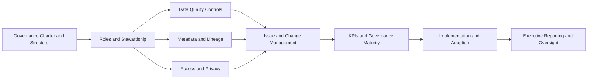

# Enterprise Data Governance Operating System

A practical enterprise data governance operating system that shows how governance moves from policy into accountable roles, working controls, metadata structures, access governance, issue handling, KPI monitoring, and implementation.

## Live dashboard

The interactive public demo for this project is here:

[Open the Streamlit dashboard](https://enterprise-data-governance-operating-system-exgkrxub7appgm3cnc.streamlit.app)

## Why this repository exists

Most governance material stops at principles. Real organizations need something more operational:

- clear decision rights
- named ownership and stewardship
- data quality controls with thresholds
- metadata and lineage structures
- access approval logic and minimum-necessary rules
- issue and change workflows
- governance KPIs and maturity tracking
- rollout, training, and adoption planning

This repository is built to show governance as an operating system rather than a policy document.

## What this repository demonstrates

- Enterprise governance operating model design
- Data owner and steward accountability structures
- Data quality framework, rule library, thresholds, and issue workflows
- Business glossary, data dictionary, and metadata operating model
- Lineage and impact analysis thinking
- Data classification, access control logic, and privacy-aware access governance
- Issue intake, escalation, root cause analysis, and change impact management
- Governance KPIs, monitoring logic, and maturity assessment
- 90-day implementation planning, rollout strategy, and adoption planning
- Executive-ready communication artifacts

## Quick scan

This repo is designed to show:

- **Operating model**: governance charter, structure, decision rights, escalation
- **Stewardship**: owner/steward model, RACI, stewardship playbook
- **Controls**: data quality framework, thresholds, issue workflow
- **Metadata**: glossary, dictionary, metadata model, impact analysis
- **Access**: classification, access workflow, minimum necessary policy
- **Issue and change**: intake, root cause, impact assessment, change notice
- **Measurement**: KPIs, monitoring logic, maturity model
- **Implementation**: 90-day roadmap, rollout strategy, adoption plan
- **Executive layer**: one-page summary and deck outline

## Operating system view

## Repository structure

### 01_operating-model
Core governance structure, decision rights, escalation logic, and operating authority.

### 02_roles_and_stewardship
Role model, stewardship playbook, and accountability design.

### 03_data_quality_controls
Data quality framework, rule logic, thresholds, issue workflows, and monitoring concepts.

### 04_metadata_and_lineage
Business glossary, data dictionary, metadata model, lineage support, and impact analysis.

### 05_access_and_privacy
Classification model, access workflows, minimum-necessary access logic, and access decision support.

### 06_issue_and_change_management
Issue intake, root cause analysis, change assessment, and structured change communication.

### 07_kpis_and_governance_maturity
Governance KPIs, monitoring logic, and maturity progression model.

### 08_implementation
90-day roadmap, rollout logic, training, and adoption planning.

### 09_executive_layer
Executive summary materials and senior-level governance communication.

## Fast-start files

Start here for the quickest view of the repository:

- `09_executive_layer/one-page-governance-summary.md`
- `01_operating-model/governance-charter.md`
- `03_data_quality_controls/dq-framework.md`
- `05_access_and_privacy/data-classification-model.md`
- `07_kpis_and_governance_maturity/governance-kpis.md`
- `08_implementation/90_day_roadmap.md`

## Practical use cases

See `USE_CASES.md` for example scenarios such as:

- repeated KPI variance
- sensitive extract access requests
- conflicting business definitions
- material reporting logic changes
- first 90 days of governance rollout

## Design principles

- Governance must be operational, not symbolic
- Accountability must be explicit
- Controls should be measurable
- Metadata should support action, not only documentation
- Access decisions should be risk-based and traceable
- Change must be communicated through defined pathways
- Governance should produce evidence of effectiveness

## Intended audience

This repository is designed for:

- data governance leads
- data management managers
- data stewards and data owners
- analytics and reporting leaders
- enterprise data office teams
- public-sector and enterprise transformation teams

## Status

Core operating model, stewardship artifacts, control frameworks, metadata structures, access governance assets, issue and change workflows, KPI logic, implementation planning, and executive-layer materials are established. The next enhancement layer is visual dashboards, lineage diagrams, and an executive briefing PDF.

## Author

**Sima Saadi**  
Applied data science, analytics engineering, governance design, reporting controls, and public-sector operating model development.
